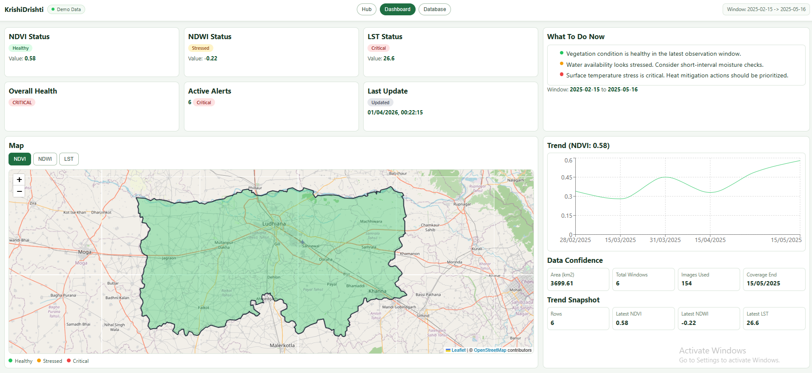

<h1 align="center">Krishi Drishti</h1>

<p align="center"><em>Satellite-Based Crop Health & Resource Advisory System</em></p>

<p align="center">
  
  
  
  
  
</p>

## Team

**Team Name:** MASY Crops  
**Members:**

- Yazdan Irfan
- Syeda Saniya Sadaf Syed Ishaque
- Md Alauddin Ansari
- Mainak Mondal

## Problem Statement

Build a system that converts raw satellite imagery into simple, actionable crop-health advisories through geospatial processing, temporal analysis, and dashboard insights.

## Approach

- Ingest and preprocess satellite data at region level
- Compute NDVI, NDWI, and LST indicators
- Compare current period against historical baseline (anomaly)
- Classify stress severity (`healthy`, `stressed`, `critical`)
- Expose insights through APIs and visualize in a farmer-friendly UI

## Repository Structure

```text
satellite-crop-advisory/
|-- api/                                  # Express + TypeScript API (client-facing backend contract)
|   |-- src/
|   |   |-- server.ts                     # API process entrypoint (loads env and starts server)
|   |   |-- app.ts                        # Express app + middleware + route registration
|   |   |-- db.ts                         # PostgreSQL connection pool
|   |   |-- docs/
|   |   |   `-- openapi.ts               # OpenAPI specification used by Swagger UI
|   |   |-- routes/                       # URL route mapping layer
|   |   |-- controllers/                  # Request validation + response shaping
|   |   |-- services/                     # Integration/business helpers (processor proxy, jobs, health, regions)
|   |   `-- repositories/                 # SQL access modules
|   `-- scripts/
|       `-- smoke-test.mjs                # API smoke-check script
|-- processor/                            # FastAPI compute service (satellite jobs + rule engine)
|   |-- Dockerfile
|   `-- src/
|       |-- main.py                       # Processor app entrypoint + router wiring
|       |-- ndvi_service.py               # Sentinel-2 NDVI compute helpers
|       |-- ndwi_service.py               # Sentinel-2 NDWI compute helpers
|       |-- lst_service.py                # MODIS LST compute helpers
|       |-- core/
|       |   |-- config.py                 # Env/config constants (CORS, GEE project)
|       |   `-- db.py                     # Postgres connection helper
|       |-- schemas/
|       |   `-- jobs.py                   # Pydantic request schema(s)
|       |-- repositories/                 # DB read/write functions (regions, index_stats, alerts)
|       |-- services/                     # Rules, job workers, job stores, stats payload shaping
|       `-- routers/                      # Processor endpoints (/health, /jobs/*, /stats/*, /alerts)
|-- frontend/                             # React + Vite playground and dashboard UI
|   |-- Dockerfile
|   `-- src/
|       |-- main.tsx                      # Frontend bootstrap
|       |-- App.tsx                       # Route shell and page switching
|       |-- api.ts                        # Typed API client contracts
|       |-- styles.css                    # Shared frontend styles
|       |-- components/
|       |   `-- PlaceholderPage.tsx       # Generic placeholder component
|       |-- lib/
|       |   `-- navigation.ts             # Route constants + navigation helper
|       `-- features/                     # Feature-wise playground pages
|           |-- hub/                      # Component hub landing page
|           |-- map/                      # Health map and boundaries
|           |-- jobs/                     # Run NDVI/NDWI/LST jobs
|           |-- trends/                   # Trends visualization
|           |-- database/                 # Data sanity view (table counts + latest rows)
|           |-- alerts/                   # Alerts table/controls
|           |-- impact/                   # Impact metrics view
|           |-- advisory/                 # Advisory messages view
|           `-- dashboard/                # Combined dashboard draft
|-- db/
|   |-- init/                             # Ordered schema/migration SQL files (001..011)
|   `-- tools/                            # Migration helper + GeoJSON import + demo seed utilities
|-- docs/
|   |-- README.md                         # Docs assets index/reference
|   `-- images/
|       `-- dashboard-draft.png           # Dashboard draft preview image used in README
|-- package.json                          # Root helper scripts (for example: seed:ui-demo)
|-- package-lock.json                     # Root lockfile
|-- .env                                  # Local runtime environment values (developer machine)
|-- .env.example                          # Root env template for Dockerized stack
|-- .gitignore                            # Git ignore rules
|-- .gitattributes                        # Git text/eol normalization rules
|-- docker-compose.yml                    # Full local stack (PostGIS, Mongo, API, Processor, Frontend)
`-- README.md                             # Project overview, progress, and runbook
```

## Milestone Breakdown


| Milestone Area                 | Scope                                                         | Status      |
| ------------------------------ | ------------------------------------------------------------- | ----------- |
| Data Ingestion & Preprocessing | Sentinel-2 + MODIS fetch, cloud filtering, region clipping    |  |
| Core Index Engine              | NDVI, NDWI, LST computation and persistence                   |  |
| Context Layer                  | Baseline lookup, anomaly calculation, severity classification |  |
| Temporal Intelligence          | Multi-window comparison and seasonal trend enhancement        |  |
| Advisory & Alerts              | Alert rules, alert storage, alert API, alert UI panel         |  |
| Dashboard Experience           | Consistent NDVI/NDWI/LST rendering and UX polish              |  |
| Validation & Reliability       | Field validation narrative, tests, CI/deployment hardening    |  |


## Current Dashboard (Draft)

**Dashboard is currently in draft state and under active iteration.**




## Setup & Run

### Prerequisites

- Docker Desktop
- Node.js + npm
- Python 3.11+
- Git
- Earth Engine CLI (`earthengine`)

### 1) Clone

```bash
git clone https://github.com/git4alauddin/satellite-crop-advisory
cd satellite-crop-advisory
```

### 2) GCP + Earth Engine Setup

1. Create or select a GCP project.
2. In Google Cloud Console, enable API for that project:
  - `Earth Engine API` (required)
  - `Cloud Resource Manager API` (optional, useful for some project/account metadata checks)
3. Use this project ID as your `GEE_PROJECT_ID`.
4. Authenticate Earth Engine from your machine:

```bash
earthengine authenticate
```

### 3) Configure Environment

Create root `.env` from `.env.example` and set:

- `GEE_PROJECT_ID` (your GCP project ID)
- `GEE_CREDENTIALS_DIR` (host path containing Earth Engine credentials)

### 4) Start Full Stack (Recommended)

```bash
docker compose up --build
```

This starts:

- `postgis`, `mongo`
- `db-migrate` (auto-applies `db/init/*.sql`)
- `processor`, `api`, `frontend`

### 5) Access

- Frontend: `http://localhost:5173`
- API health: `http://localhost:4000/health`
- Processor health: `http://localhost:8000/health`

### API Docs

- API Swagger UI: `http://localhost:4000/docs`
- API OpenAPI JSON: `http://localhost:4000/openapi.json`
- Processor Docs: `http://localhost:8000/docs`

### 6) Quick Commands (for daily use)

```bash
# Start full stack
docker compose up -d --build

# If frontend changes are not reflected
docker compose up -d --build frontend
# (if still stale, hard refresh browser: Ctrl+F5)

# Reset deterministic UI demo data
npm run seed:ui-demo
```

## Milestones Ahead

- Final dashboard polish for presentation-ready UX
- Expand to additional official region boundaries (beyond current Ludhiana demo region)
- Strengthen reliability with deeper automated tests (integration + negative paths)
- Add CI + deployment hardening (required checks, build pipeline, runbook)
